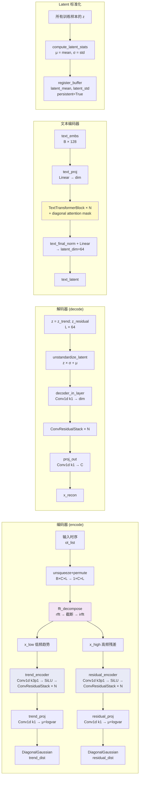
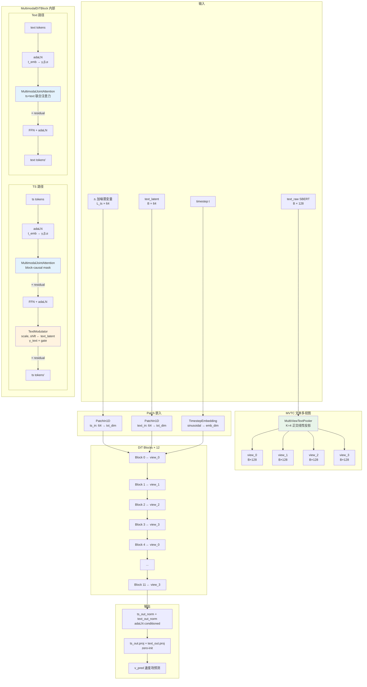
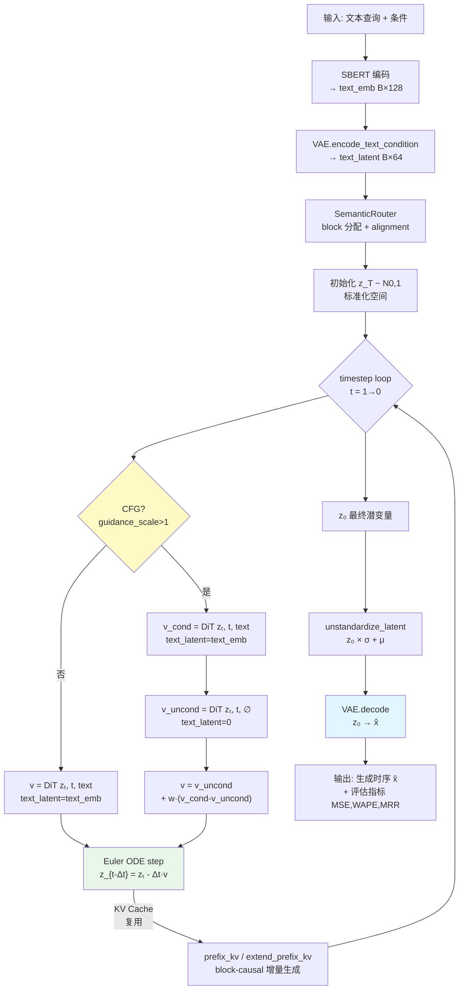
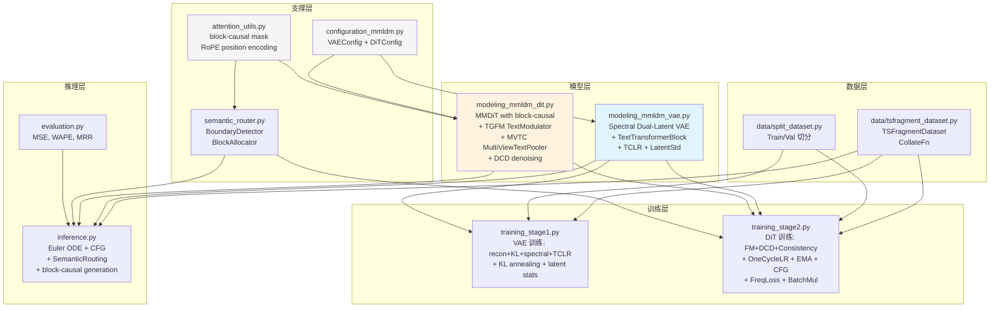

# MMLDM V2 架构图 (feature/mmv2-spectral-dual-latent)

## 整体两阶段训练

```mermaid
graph TB
    subgraph "数据管线"
        TS[时序数据<br/>ETTh1 × 24h]
        SBERT[SBERT 文本嵌入<br/>128-dim]
        TS --> |TSFragmentDataset| FRAG[时序片段<br/>(L, C) per sample]
        SBERT --> EMB[文本嵌入<br/>(B, 128)]
    end

    subgraph "Stage 1: VAE 训练"
        FRAG --> VAE[MMLDMVAEModel<br/>Spectral Dual-Latent VAE]
        FFT[FFT 分解<br/>cutoff_ratio=0.3]
        FFT --> |低频趋势| TREND_ENC[trend_encoder<br/>Conv1d × ConvResidualStack]
        FFT --> |高频残差| RESID_ENC[residual_encoder<br/>Conv1d × ConvResidualStack]
        TREND_ENC --> TREND_PROJ[trend_proj → z_trend<br/>DiagonalGaussian]
        RESID_ENC --> RESID_PROJ[residual_proj → z_residual<br/>DiagonalGaussian]
        TREND_PROJ --> MERGE[[z = z_trend; z_residual]]
        RESID_PROJ --> MERGE
        MERGE --> STD[潜变量标准化<br/>dataset-level μ, σ]
        STD --> DECODER[Conv1d Decoder → x_recon]
        DECODER --> L_RECON[MSE Loss<br/>L_recon]
        TREND_PROJ --> KL[KL Loss<br/>L_kl]
        RESID_PROJ --> KL
        DECODER --> SPECTRAL[频谱重建 Loss<br/>per-sample FFT L1]
        MERGE --> TCLR[TCLR Loss<br/>时序对比正则化]
        L_RECON --> L1_TOTAL[Stage1 Total Loss]
        KL --> L1_TOTAL
        SPECTRAL --> L1_TOTAL
        TCLR --> L1_TOTAL
    end

    subgraph "从 Stage1 到 Stage2"
        STD --> LATENT_STATS[latent_mean & latent_std<br/>存入 checkpoint]
        MERGE --> Z0[潜变量 z₀<br/>(L, latent_dim=64)]
    end

    subgraph "Stage 2: DiT 训练"
        Z0 --> DIT[MMLDMDiTModel<br/>Flow Matching]
        EMB --> |text_raw B×128| MVTC
        EMB --> |text_emb| VAE_ENC[VAE.encode_text_condition]
        VAE_ENC --> |B×64| DIT
    end

    style VAE fill:#e1f5fe
    style DIT fill:#fff3e0
    style FFT fill:#f3e5f5
    style MVTC fill:#e8f5e9
```

## VAE 架构细节 (modeling_mmldm_vae.py)



## DiT 架构细节 (modeling_mmldm_dit.py)



## 训练流程

```mermaid
flowchart TD
    subgraph "Stage 1 训练 (training_stage1.py)"
        S1_INIT[初始化 VAE<br/>MMLDMVAEModel] --> S1_EPOCH{epoch loop}
        S1_EPOCH --> KL_BETA[KL β annealing<br/>start→end over N epochs]
        KL_BETA --> S1_BATCH{遍历 batch}
        S1_BATCH --> S1_FWD[model.forward<br/>encode → sample → standardize → decode]
        S1_FWD --> S1_LOSS["L = L_recon + β·KL<br/>+ γ_spec·L_spectral + γ_tclr·L_TCLR"]
        S1_LOSS --> S1_BACK[backward + clip_grad + step]
        S1_BACK --> |epoch==0| LATENT_STATS[compute_latent_stats<br/>存入 buffer]
        S1_BACK --> S1_CKPT[save checkpoint .pt]
    end

    subgraph "Stage 2 训练 (training_stage2.py)"
        S2_LOAD[加载 VAE checkpoint<br/>+ latent stats] --> S2_INIT[初始化 DiT<br/>MMLDMDiTModel]
        S2_INIT --> S2_EPOCH{epoch loop<br/>OneCycleLR}
        S2_EPOCH --> S2_SAMPLE[采样 z₀ = VAE.encode<br/>标准化后的潜变量]
        S2_SAMPLE --> S2_BATCHMUL[batch_mul<br/>z₀ repeat ×4]
        S2_BATCHMUL --> S2_TIMESTEP[采样 t ~ U0,1<br/>text_adaptive SNR]
        S2_TIMESTEP --> S2_CFG[CFG dropout 0.3<br/>√ text_latent × mask<br/>√ text_emb × mask]
        S2_CFG --> S2_FWD[DiT.forward<br/>zₜ = t·noise + 1-t·z₀<br/>v_pred = DiT zₜ, t, text, text_latent]
        S2_FWD --> S2_LOSS["L = L_FM<br/>+ γ1·L_DCD_mix<br/>+ γ2·L_DCD_aux<br/>+ γ_cons·L_consistency"]
        S2_LOSS --> S2_BACK[backward + step<br/>EMA update 0.9999]
    end

    style S1_LOSS fill:#e1f5fe
    style S2_LOSS fill:#fff3e0
```



## 推理流程 (inference.py)



## 模块依赖关系



## 创新点映射

| 创新 | 文件 | 核心组件 | 数学基础 |
|------|------|---------|---------|
| **A: Spectral Dual-Latent** | `modeling_mmldm_vae.py` | `fft_decompose` + 双 Conv1d 编码器 | FFT 频域分解 → trend + residual 子空间 |
| **C: TCLR** | `modeling_mmldm_vae.py` | `_compute_tclr()` | 时序对比学习: d_pos < d_neg + margin |
| **TGFM** | `modeling_mmldm_dit.py` | `TextModulator` | 文本 → (scale, shift) 双通路独立调制 |
| **MVTC** | `modeling_mmldm_dit.py` | `MultiViewTextPooler` | K 正交投影 → 文本语义多视图 cycling |
| **FreqLoss** | `training_stage2.py` | `frequency_weighted_flow_loss` | L = L_time + γ_freq·L_FFT + γ_w·Σ(1/k)·|Δz| |
| **BatchMul** | `training_stage2.py` | `repeat_interleave(batch_mul)` | 同样本多 t → 密集训练信号 |
| **CFG** | `training_stage2.py` + `inference.py` | dropout 0.3, guidance_scale 7.0 | v = v_uncond + w·(v_cond - v_uncond) |
| **DCD** | `training_stage2.py` + `modeling_mmldm_dit.py` | `compute_dcd_losses` | 混合潜变量 → 双条件去噪 |
| **LatentStd** | `modeling_mmldm_vae.py` | `standardize_latent` | z_norm = (z - μ_dataset) / σ_dataset |
